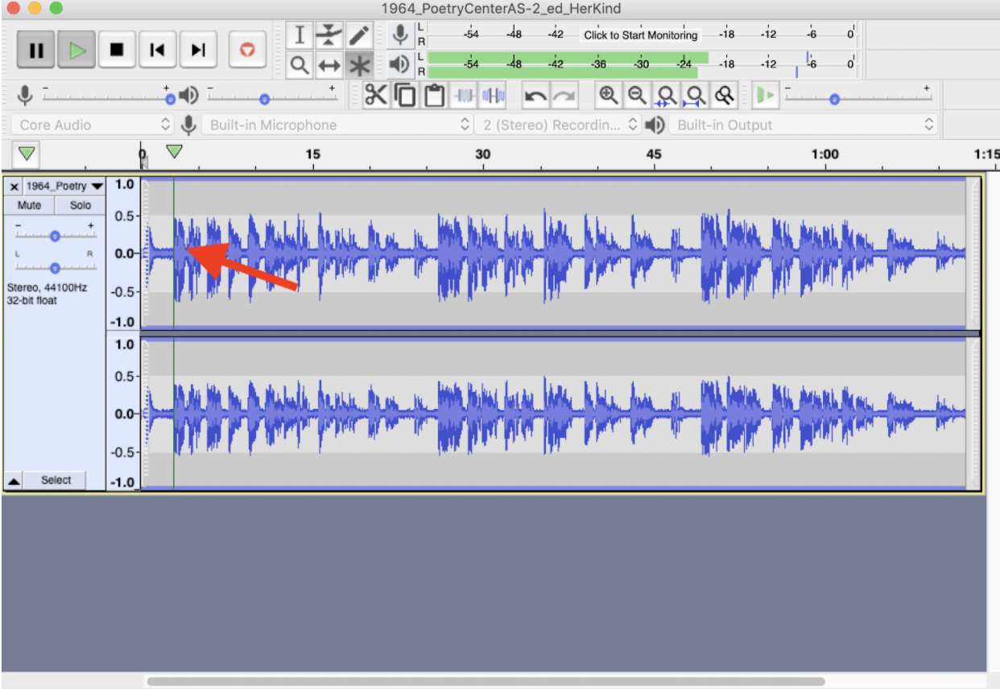
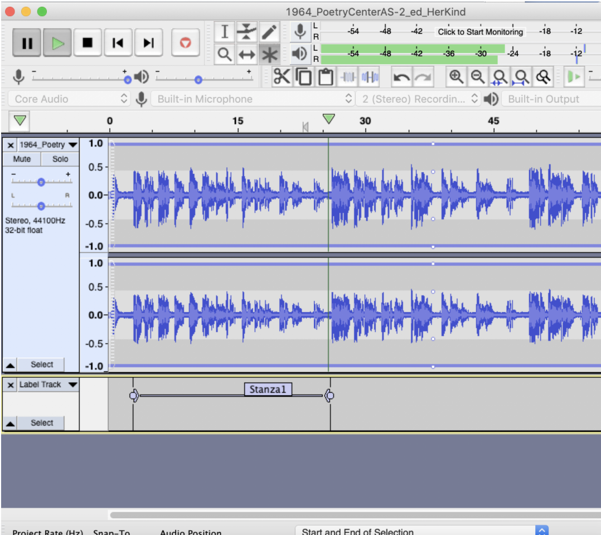

# AudiAnnotate Workflow

* [Part 1: Downloading Audacity](#aud)
* [Part 2: Creating Labels in Audacity](#labels)
* [Part 3: Exporting Labels From Audacity](#export)
* [Part 4: Getting an Audio Link for Your Project](#audilink)
* [Part 5: Using AudiAnnotate to Save and Align Labels with Audio](#aa)

### Part 1: Downloading Audacity

* If you have a Mac, navigate to [Audacity's Mac download page](https://www.audacityteam.org/download/mac/). There, you'll download the .dmg file and double-click to follow instructions for downloading Audacity to your machine. We recommend downloading the latest version, 2.3.3.

* If you have a PC, navigate to [Audacity's PC download page](https://www.audacityteam.org/download/windows/). There, you'll download the installer and follow instructions for downloading Audacity to your machine. We recommend downloading the latest version, 2.3.3.

### Part 2: Creating Labels in Audacity

1. Open Audacity, and in the top left, navigate to file→ Open → file name

2. On the warning screen, make sure the make a copy choice is selected, then click ok.

3. There are multiple ways to annotate a stanza. First, we’ll try ranges. To insert a range, you’ll pause the poem by clicking the “p” key when you hear the first line of the stanza begin. 

4. Click the time marker line to mark the place in time where you want to add the label. This typically will correspond to the place where you paused the audio (see image below)

     

5. Then, you’ll click command + b to add a label. A field will pop up, and you can type your annotation. (Example: You may add “Stanza1” to mark the first stanza of a poem.)

    

6. To create the range, you’ll click and drag the right edge of the point to the end of the stanza. You’ll have to play the recording to know where to end the stanza. A completed range will look like this: 

    

7. Those are the basics. Feel free to annotate as you wish, thinking about the issues you run into and what works or doesn’t work for you. 

#### Another way to add labels in Audacity

1. When you open the app and add audio, go to Edit → Labels, then click “Type to create a label”

2. Now as you’re listening, when you type any key, a label will begin

3. Using this method, to pause the audio, you need to use the pause button on the upper left of the interface

### Part 3: Exporting Labels from Audacity

1. Go to File → Export → Export Labels

2. Name your labels and save as a .txt file. You will need this file when creating your project with the AudiAnnotate application. 

### Part 4: Getting an Audio Link for Your Project
AudiAnnotate needs a direct link to either a .mp3 or .wav audio file to add audio to your project. Below are instructions on how to get a direct link for your audio file from three common file-hosting sites: Internet Archive, Google Drive, and Box.

##### Internet Archive
*Uploading a file to Internet Archive*
1. Click the upload button at the top right corner of your screen.
2. Click the “Upload Files” button. 
3. Select your desired file and click the “Open” button.
4. Fill in the required fields of the metadata box and click the “Upload and Create Your Item” button. 

*Retrieving a file link from Internet Archive:*
1\. On the details page of your desired file, navigate to the “VBR MP3” download option and click the link.  
2\. The link in your browser’s search bar can be used in AudiAnnotate.

##### Google Drive
*Uploading a file to Google Drive:*
1\. Click the “New” button in the top left corner of your screen.
2\. Select “File Upload.” 
3\. Select your desired file. Make sure it is one of the supported file types (.mp3, .wav).
4\. Click the “Open” button.

*Retrieving a file link from Google Drive:*
1\. Click on the file in your Google Drive. 
*Note: This will bring you to a page that plays the audio file, not the file itself. The link in your bowser’s search bar cannot be used in AudiAnnotate.*
2\. Click the dotted icon at the top right corner of the page and click “Share.” The sharing box will pop up on your screen.
3\. Click “Get shareable link” at the top corner of the box and make sure your sharing settings are on “Anyone with the link can edit.”
4\. Copy and paste this link somewhere where you can view it in full.
5\. Copy the File ID. The File ID is the characters between “https://drive.google.com/filed/d/” and “/view?usp=sharing”. 
6\. Paste the File ID in either of these two links, replacing the Xs with your File ID: 
7\. This new link can be used in AudiAnnotate. It will look something like this:

##### Box
*Uploading a file to Box:*
1\. Click the “Upload” button in the top right corner of your screen. 
2\. Click “File.”
3\. Select your desired file and click the “Open” button. 

*Retrieving a file link from Box:*
1\. Navigate your mouse until it’s hovering over your desired file.
2\. Click the link button.
3\. Make sure the shared link button is enabled and copy the link from the highlighted.
4\. This link can now be used in AudiAnnotate. The example link (from a UT Box account) in full:

### Part 5: Using AudiAnnotate to Save and Align Labels with Audio

1\. Navigate to the [AudiAnnotate Application](http://audiannotate.brumfieldlabs.com/)

  * This will prompt you to log in through GitHub (make sure to allow the app to authorize saracarl)

  * Enter your GitHub password to log in

2\. Click "Create New Project"

  * Project ID = repository name (no spaces)

  * Add title and description

3\. Click “Create project”

  * This contacts the github page and  generates repository

4\. Now, on the Audio files page, click “New Item.” This is where you will add metadata for your audio recording.

  * Add label for your audio file
  
  * Add URL for  audio 
  
  * Add duration in seconds
  
  * Other fields are additional metadata from provider
  
5\. Click “Create item” 

6\. Now, on the  annotations page, add a label for your annotations layer. This is where you will upload your .txt labels from Audacity

7\. Click “Choose file”  (.txt labels export from Audacity) 

8\. Click “Add” at the bottom of the page. This will generate your annotations and align them in the IIIF manifest with the audio file. 

9\. From the next screen, you can use the links on the top of the  screen to access your  IIIF manifest and the github pages site. 

10\. Clicking “add” at the bottom of the page allows you to add additional annotation layers to the same audio 

